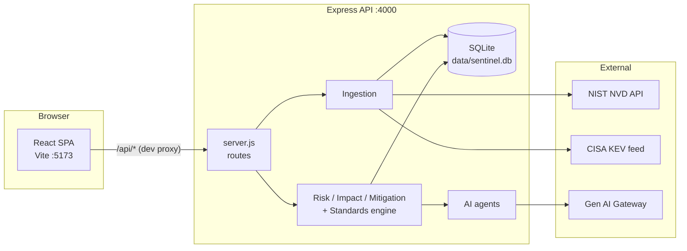
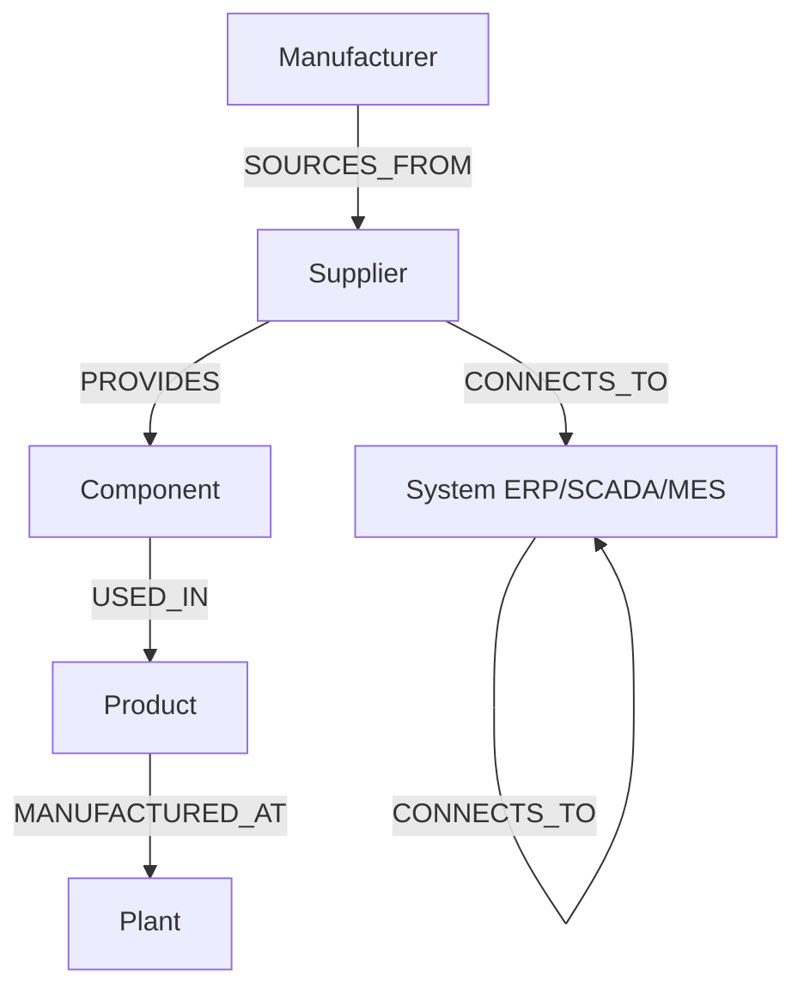
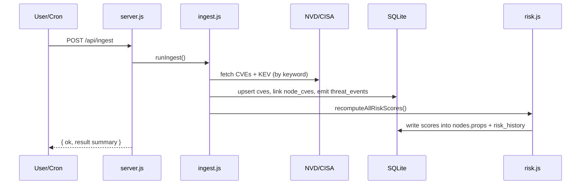
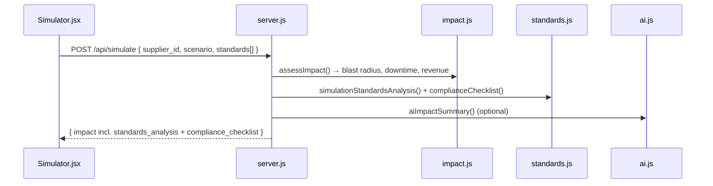

# SupplyChain Sentinel AI — Architecture & Developer Guide

A complete, file-by-file explanation of how the platform works and how every
piece connects. This is the deep-dive companion to the top-level `README.md`
(which covers setup/run commands).

---

## 1. What the product does

SupplyChain Sentinel AI is a **supply-chain cyber-risk intelligence platform**.
For a manufacturer ("Helios Motorworks") it:

1. Models the multi-tier supply chain as a **dependency graph** (manufacturer →
   suppliers → components → products → plants, plus IT/OT systems).
2. Pulls **live vulnerability intelligence** from NIST NVD and the CISA KEV
   catalog and links it to suppliers via real vendor keywords (Siemens,
   Schneider, ABB, etc.).
3. Computes a **composite risk score** per supplier and a **blast radius**
   (which plants/products/revenue are hit if a supplier is breached).
4. Generates a **mitigation playbook** and ranked **alternate suppliers**.
5. Assesses everything against six **security standards** (ISO/IEC 27001, 27002,
   27005, CVSS v3.1, CISA KEV, NIST SP 800-53), including a control-by-control
   pass/fail audit.
6. Adds optional **AI narrative summaries** on top of the deterministic engine.

---

## 2. Tech stack

| Layer    | Technology                                                            |
| -------- | -------------------------------------------------------------------- |
| Backend  | Node.js (ES modules), Express 4, built-in `node:sqlite`             |
| AI       | OpenAI / Anthropic / Bedrock SDKs (via the PwC Gen AI gateway)       |
| Frontend | Vite 6, React 18, React Router 6, Tailwind CSS 3, Recharts, React Flow |
| Data     | NIST NVD API v2.0, CISA KEV JSON feed                                |

The app is a **monorepo of two independent apps**: `backend/` (the API + engine)
and `frontend/` (the dashboard). They communicate only over HTTP `/api/*`.

---

## 3. High-level architecture



**Request rule:** the browser always calls relative `/api/*` paths. In dev,
Vite proxies those to `http://localhost:4000` (see `frontend/vite.config.js`), so
there are no CORS/host concerns in the UI code.

---

## 4. Directory map (every file)

```
Sentinal/
├── README.md                      Setup & run instructions
├── ARCHITECTURE.md                This document
├── .gitignore                     Ignores node_modules, data/, .env.local
│
├── backend/                       Express API + engine (Node, ES modules)
│   ├── package.json               Deps (express, cors, AI SDKs) + npm scripts
│   ├── .env.example               Template for environment variables
│   ├── .env.local                 Real secrets (gitignored): AI key, model, NVD key
│   ├── server.js                  HTTP entrypoint: all /api/* routes + boot
│   ├── data/sentinel.db           SQLite database file (created at runtime)
│   ├── lib/
│   │   ├── env.js                 Minimal .env loader (no dependency)
│   │   ├── db.js                  SQLite wrapper, schema, seeding, query API
│   │   ├── seed-data.js           The synthetic graph (nodes + edges)
│   │   ├── graph.js               Graph loader + blast-radius BFS + reachability
│   │   ├── nvd.js                 Live NIST NVD API client
│   │   ├── cisa.js                Live CISA KEV catalog client
│   │   ├── ingest.js              Orchestrates CVE ingestion + linking
│   │   ├── risk.js                Composite risk scoring engine
│   │   ├── impact.js              Blast-radius impact assessment
│   │   ├── mitigation.js          Mitigation playbook + alternate suppliers
│   │   ├── standards.js           Standards/control engine (the compliance brain)
│   │   └── ai.js                  Three LLM agents (provider-agnostic)
│   └── scripts/
│       ├── seed.js                CLI: init/seed the DB and print counts
│       ├── ingest.js              CLI: run a full live ingestion
│       └── ai-test.js             CLI: smoke-test the AI gateway
│
└── frontend/                      Vite + React SPA
    ├── package.json               Deps (react, router, recharts, react-flow)
    ├── vite.config.js             Dev server + /api proxy to backend
    ├── tailwind.config.js         Theme tokens (light enterprise + indigo)
    ├── postcss.config.js          Tailwind/autoprefixer pipeline
    ├── index.html                 HTML shell + favicon + mount point
    └── src/
        ├── main.jsx               React entry: Router + mounts <App/>
        ├── App.jsx                Layout + route table
        ├── index.css             Global styles, .card/.btn/.tag, gradients
        ├── components/
        │   ├── NavBar.jsx         Top nav + live status (CVE/KEV/AI badges)
        │   └── widgets.jsx        Reusable: RiskBadge, ScoreBar, Stat, SectionTitle
        ├── lib/
        │   └── ui.js              Band helpers, BAND_HEX colors, fmtUsd
        └── pages/
            ├── Dashboard.jsx      Leaderboard, stats, threat feed, CVEs, standards
            ├── Graph.jsx          Interactive dependency graph (React Flow)
            ├── Simulator.jsx      Breach simulation + standards selector + audit
            └── Mitigation.jsx     Playbook + alternates + compliance posture
```

---

## 5. Backend — file by file

### 5.1 `server.js` — the HTTP entrypoint

- Imports `./lib/env.js` **first** so env vars load before anything reads them.
- Creates the Express app, enables `cors()` and `express.json()`.
- `wrap(fn)` — wraps every async route so thrown errors become clean 500s.
- Defines all routes (see [API reference](#8-api-reference)).
- On boot it calls `getDb()` (which initializes + seeds the DB) **before**
  `app.listen()`, and handles `EADDRINUSE` gracefully.

It is the only file that knows about HTTP. Every route delegates to a `lib/*`
function, keeping the engine framework-agnostic.

### 5.2 `lib/env.js` — environment loader

A tiny, dependency-free `.env` parser. Loads `.env.local` then `.env` from the
backend working directory, **without** overriding already-set process env vars.
Strips quotes and ignores comments/blank lines.

### 5.3 `lib/db.js` — database layer

Wraps Node's built-in `node:sqlite` (`DatabaseSync`).

- **`Database` class** — a Promise-style wrapper exposing `query`, `exec`,
  `transaction`. It translates Postgres-style `$1..$n` placeholders into
  positional `?`, normalizes booleans→`0/1`, and transparently JSON-parses the
  `props` and `linked_cves` TEXT columns on read.
- **`init()`** — creates the `data/` dir, opens `sentinel.db` (WAL mode), creates
  all tables/indexes, then calls `ensureSeeded`.
- **`ensureSeeded(db)`** — if `nodes` is empty, bulk-inserts the seed graph in a
  transaction.
- **`getDb()`** — memoizes the init promise on `globalThis.__sentinel_db` so the
  DB is a singleton across the process.

**Schema** (all tables):

| Table           | Purpose                                                    |
| --------------- | --------------------------------------------------------- |
| `nodes`         | Graph vertices (suppliers, plants, components, …) + `props` JSON |
| `edges`         | Graph relationships with `props` (incl. propagation `weight`) |
| `cves`          | Ingested CVEs (cvss, severity, `known_exploited`, source) |
| `node_cves`     | Many-to-many link: which CVE matched which supplier        |
| `threat_events` | KEV-driven "actively exploited" alerts                    |
| `risk_history`  | Time series of supplier scores (used for the risk delta)   |

### 5.4 `lib/seed-data.js` — the supply-chain model

Exports `nodes` and `edges` for "Helios Motorworks". Node types:
**Manufacturer, Plant, Product, Component, Supplier, System**. Edge types:
`SOURCES_FROM`, `PROVIDES`, `USED_IN`, `MANUFACTURED_AT`, `CONNECTS_TO`.

Two things make this "real, not mock":

- Each **supplier's `keywords`** are real industrial vendors (Siemens, Schneider,
  Moxa, ABB, Rockwell, …) → these drive **live** CVE matching.
- Each **edge has a `weight`** (e.g. sole-source = 1.0, redundant = 0.4) → this
  drives the blast-radius propagation math.

Supplier `props` include `tier`, `country`, `region`, `keywords`,
`erp_connected`, `last_audit_date`, `is_redundant`, `quality_rating`,
`capacity_pct`, `lead_time_days`, `component_categories`, `base_risk` — all of
which feed the risk and standards engines.

### 5.5 `lib/graph.js` — graph algorithms

- **`loadGraph()`** — reads nodes/edges from SQLite into an in-memory `{ nodes:
  Map, adjacency: Map, edges: [] }` structure.
- **`bfsBlastRadius(graph, startId, sourceRisk)`** — the core propagation
  algorithm. Weighted BFS where `propagatedRisk = parentRisk × edgeWeight`. A
  branch stops when propagated risk drops below the alert threshold (10). Returns
  affected nodes sorted by propagated risk. **This is what powers impact/blast
  radius.**
- **`reachableByType(graph, startId, type)`** — downstream nodes of a type (used
  to count how many Plants a supplier can take down → "connectivity").
- **`countReachablePlants(supplierId)`** — convenience wrapper.

### 5.6 `lib/nvd.js` — NIST NVD client

- **`fetchCvesForKeyword(keyword)`** — queries the live NVD v2.0 API for a
  vendor keyword, extracts the CVSS v3.1/3.0/2.0 base score + severity, filters
  to `cvss ≥ 7.0`, retries on 503/429 with exponential backoff, returns the top
  8 CVEs.
- **`delay(ms)`** — shared throttle helper.

### 5.7 `lib/cisa.js` — CISA KEV client

- **`fetchKevForKeywords(keywords)`** — downloads the public KEV JSON (cached 1h)
  and returns entries whose vendor/product/name match any supplier keyword. KEV
  entries are flagged `known_exploited: true` and treated as CVSS 9.0/Critical.

### 5.8 `lib/ingest.js` — the ingestion pipeline

**`runIngest()`** orchestrates a full refresh:

1. Loads suppliers, builds a `keyword → supplierIds` map (de-dupes API calls).
2. Fetches the CISA KEV catalog once; for each match: `upsertCve`, `linkCve`
   (into `node_cves`), and `emitThreatEvent` (into `threat_events`).
3. For each unique keyword: fetch NVD CVEs (throttled — ~6.5s without an API key,
   ~0.8s with one), upsert + link them.
4. Calls **`recomputeAllRiskScores()`** so scores reflect the new intel.

Returns a summary `{ suppliers_scanned, nvd_cves, kev_cves, links_created, … }`.

### 5.9 `lib/risk.js` — risk scoring engine

The composite score formula (weights sum to 100):

```
Risk = (max_cvss/10 × 40) + (breach ? 30 : 0)
     + (min(patch_lag,20)/20 × 20) + (min(plants,10) × 1)
Score = min(100, max(computed, base_risk))   // base_risk is the floor
```

- **`gatherInputs()`** — per supplier, pulls linked CVEs, computes `max_cvss`,
  `breach_indicator` (any KEV), a `patch_lag_days` proxy (age of the top CVE,
  capped at 20), and `connected_plant_count` (via `reachableByType`).
- **`scoreFor(i)` / `bandFor(score)`** — compute the 0–100 score and band
  (≥70 critical, ≥40 medium, else low).
- **`recomputeAllRiskScores()`** — scores every supplier, writes the result back
  into `nodes.props`, appends to `risk_history` (to derive the delta), and
  returns enriched profiles.
- **`withStandards(profile)`** — decorates each profile with `cvss_severity`
  (CVSS v3.1 band) and `iso27005` (likelihood × consequence) from `standards.js`.
- **`getRiskProfiles()`** — fast read of the persisted scores (used by most
  routes) without recomputing.

### 5.10 `lib/impact.js` — blast-radius impact

**`assessImpact(supplierId, scenario)`** computes the business impact:

- Runs `bfsBlastRadius` to find affected **plants** and **products**.
- Determines **critical products** via `is_critical_path` edges.
- Computes **downtime** = worst-case gap between component replacement lead time
  and safety stock (sole-source components recover slower).
- Computes **revenue at risk** = daily revenue of affected critical products ×
  downtime.
- Attaches **linked CVEs** and a **confidence** level.

Returns the full `impact` object consumed by the Simulator, Graph and Mitigation.

### 5.11 `lib/mitigation.js` — playbook + alternates

- **`findAlternateSuppliers(graph, id, impact)`** — ranks other suppliers by a
  weighted **similarity score**: `componentMatch×0.4 + geoProximity×0.25 +
  quality×0.2 + capacity×0.15` (geo uses a region-adjacency matrix).
- **`buildActions(...)`** — generates a 4-phase playbook (immediate / short /
  medium / long term) with concrete, data-filled steps, and attaches the mapped
  ISO 27002 + NIST 800-53 **controls** per phase (`controlsForCategory`).
- **`buildMitigationPlan(supplierId, impact)`** — assembles actions + alternates
  + the supplier **compliance posture** (`supplierComplianceFindings`).

### 5.12 `lib/standards.js` — the compliance/standards engine

This is the "brain" for standards. It is **a rules engine over live data** — the
definitions are in code, the verdicts are computed at runtime. Key exports:

| Export | Role |
| ------ | ---- |
| `STANDARDS` | Catalog of the 6 frameworks (name, category, summary, URL) |
| `CONTROL_LIBRARY` | Curated ISO 27002:2022 + NIST 800-53 Rev.5 controls (id→title) |
| `controlsForCategory(cat)` | Maps a mitigation phase → its controls |
| `cvssV31Severity(score)` | FIRST-spec band mapping (None/Low/Medium/High/Critical) |
| `iso27005Likelihood / Consequence / Rating / Assessment` | ISO 27005 risk = likelihood × consequence |
| `supplierComplianceFindings(profile, props)` | met/partial/gap control posture for a supplier |
| `simulationStandardsAnalysis(ids, ctx)` | Per-standard summary cards for a breach |
| `complianceChecklist(ids, ctx)` | **Control-by-control PASS/FAIL/PARTIAL/NA audit** (28 parameters) |

The `complianceChecklist` evaluates each parameter against real signals (KEV
status, max CVSS, audit recency, sole-source vs redundant, ERP connectivity,
blast radius) and returns a rationale + remediation for every check. See
[Standards assessment](#9-how-standards-assessment-works).

### 5.13 `lib/ai.js` — the three AI agents

Provider-agnostic LLM layer. Resolves provider/key/baseURL/model from env and
exposes:

- **`aiRiskSummary(profile)`** — executive one-liner for a supplier.
- **`aiImpactSummary(impact, query)`** — CISO-level breach narrative.
- **`aiMitigationSummary(plan)`** — response-strategy briefing.
- **`isAiEnabled()`** — whether AI is configured.

If the gateway is unreachable or unconfigured, all agents return `null` and the
platform falls back to its deterministic computed text — **AI is purely additive.**

### 5.14 `scripts/*` — CLI utilities

| Script | Command | What it does |
| ------ | ------- | ------------ |
| `seed.js` | `npm run seed` | Initializes/seeds the DB, prints node/edge counts |
| `ingest.js` | `npm run ingest` | Runs a full live NVD+KEV ingestion |
| `ai-test.js` | `npm run ai-test` | Smoke-tests the AI gateway with a sample profile |

---

## 6. Data model & graph



A supplier breach propagates **down** this graph (PROVIDES → USED_IN →
MANUFACTURED_AT) to reach plants and revenue, with each hop attenuated by the
edge `weight`. Sole-source links (weight 1.0) propagate full risk; redundant
links (weight 0.4) attenuate it.

---

## 7. End-to-end data flows

### 7.1 Ingestion → scoring



### 7.2 Breach simulation (with standards)



---

## 8. API reference

All routes live in `server.js` under `/api`.

| Method | Route | Body / Query | Returns |
| ------ | ----- | ------------ | ------- |
| GET | `/api/status` | — | AI status, CVE/KEV/threat counts, last ingest |
| GET | `/api/suppliers` | — | Risk profiles (sorted leaderboard, incl. `cvss_severity`, `iso27005`) |
| GET | `/api/graph` | — | `{ nodes, edges }` for React Flow |
| GET | `/api/cves` | `?supplier=<id>` (opt) | CVEs enriched with `cvss_severity` |
| GET | `/api/threats` | — | Threat events (KEV signals) + supplier names |
| GET | `/api/standards` | — | `STANDARDS` catalog + `CONTROL_LIBRARY` |
| GET | `/api/compliance` | `?supplier=<id>` (opt) | Per-supplier control findings + summary |
| POST | `/api/simulate` | `{ supplier_id?, scenario, query?, standards[] }` | `impact` incl. `standards_analysis` + `compliance_checklist` |
| POST | `/api/mitigate` | `{ supplier_id, scenario? }` | `plan` (actions, alternates, compliance) + `impact` |
| POST | `/api/ingest` | — | Runs live ingestion + recompute |
| GET | `/api/health` | — | `{ ok: true }` |

Notes:
- `/api/simulate` accepts natural language (`query`) and infers the supplier via
  `inferSupplierFromQuery` when `supplier_id` is omitted.
- `standards[]` filters which frameworks the analysis/checklist evaluates.

---

## 9. How standards assessment works

Everything is **deterministic rules over live inputs** (the AI never decides
pass/fail). Inputs per supplier: linked CVEs (with CVSS + KEV flag), `max_cvss`,
`patch_lag_days`, `breach_indicator`, `connected_plant_count`, `risk_score`,
plus props (`last_audit_date`, `erp_connected`, `is_redundant`).

| Standard | How it's assessed |
| -------- | ----------------- |
| **CVSS v3.1** | FIRST band mapping of base scores; counts Critical/High/Medium/Low |
| **CISA KEV** | Filters CVEs to `known_exploited`; presence → likelihood "Very High" |
| **ISO/IEC 27005** | `risk = likelihood × consequence` (likelihood from KEV/CVSS/patch-lag; consequence from blast radius); rating bands 70/40/20 |
| **ISO/IEC 27001** | Maps the 27005 rating to a Clause 6.1.3 treatment (Modify / Modify-Share / Retain) + ISMS control-gap posture |
| **ISO/IEC 27002** | Per Annex A control (5.7, 5.20, 5.21, 5.22, 5.30, 8.8, 8.16…) → met/partial/gap by rule |
| **NIST SP 800-53** | Per control (RA-3, RA-5, SI-5, CA-7, SR-3/6/8/11, IR-4, CP-2, SC-7) → met/partial/gap |

The Simulator's **control-by-control checklist** runs `complianceChecklist`,
which produces ~28 individual PASS/FAIL/PARTIAL/NA checks across the selected
standards, each with a rationale (the evidence) and a remediation.

> The control library and thresholds are a curated, hackathon-scoped subset
> encoded in `standards.js` — accurate to the standards' intent but not the full
> catalogs, and the numeric thresholds are reasonable interpretations (ISO 27005
> leaves exact scales to the organization).

---

## 10. Frontend — file by file

### 10.1 Entry & layout

- **`index.html`** — HTML shell, inline SVG favicon, `#root` mount, loads
  `src/main.jsx`.
- **`src/main.jsx`** — mounts React in `StrictMode` inside a `BrowserRouter`.
- **`src/App.jsx`** — the layout (`NavBar` + `<main>`) and the route table:
  `/` → Dashboard, `/graph` → Graph, `/simulator` → Simulator, `/mitigation` →
  Mitigation.
- **`src/index.css`** — Tailwind layers + global element styles + reusable
  component classes (`.card`, `.btn`, `.btn-primary`, `.tag`) and the
  `.pwc-gradient` / `.pwc-text-gradient` accent helpers.

### 10.2 Config

- **`vite.config.js`** — dev server on 5173 and the `/api` → backend proxy.
- **`tailwind.config.js`** — theme tokens: `bg.*` (light surfaces), `line`,
  `risk.{low,medium,critical}`, and `accent` (indigo). Changing these requires a
  Vite restart to recompile.
- **`postcss.config.js`** — wires Tailwind + autoprefixer.

### 10.3 Shared UI

- **`components/NavBar.jsx`** — sticky top nav; fetches `/api/status` and shows
  live CVE count, KEV count, and an AI Active/Off badge. Highlights the active
  route.
- **`components/widgets.jsx`** — `RiskBadge`, `ScoreBar`, `Stat` (with colored
  accent rail), `SectionTitle`. Used across all pages.
- **`lib/ui.js`** — `bandFromScore`, `BAND_HEX` (band→color), `BAND_LABEL`,
  `bandClasses`, `fmtUsd`. Single source of truth for risk colors/formatting.

### 10.4 Pages (each fetches the API and renders)

| Page | Calls | Renders |
| ---- | ----- | ------- |
| **Dashboard.jsx** | `/api/suppliers`, `/api/cves`, `/api/threats`, `/api/standards`; POST `/api/ingest` | Stat cards, risk leaderboard + bar chart (Recharts), threat feed, CVE intelligence (with CVSS v3.1 + KEV tags), standards catalog |
| **Graph.jsx** | `/api/graph`; POST `/api/simulate` | Interactive dependency graph (React Flow) with layered layout, legend, node inspector, and live blast-radius highlight |
| **Simulator.jsx** | `/api/suppliers`, `/api/standards`; POST `/api/simulate` | Scenario runner, **standards selector chips**, impact metrics, AI analysis, and the **control-by-control assessment** matrix |
| **Mitigation.jsx** | `/api/suppliers`; POST `/api/mitigate` | 4-phase playbook (with mapped controls), ranked alternate suppliers, compliance posture, ISO 27005 rating |

---

## 11. How a single user action flows end-to-end

**Example: user runs a simulation on the Simulator page.**

1. `Simulator.jsx` POSTs `/api/simulate` with `{ supplier_id, scenario,
   standards[] }` (the proxy forwards it to `:4000`).
2. `server.js` route handler calls `assessImpact()` (`impact.js`), which uses
   `loadGraph()` + `bfsBlastRadius()` (`graph.js`) and queries `cves`/`node_cves`
   (`db.js`).
3. The handler fetches the supplier profile (`getRiskProfiles`), props, and CVEs,
   then calls `simulationStandardsAnalysis()` and `complianceChecklist()`
   (`standards.js`).
4. Optionally `aiImpactSummary()` (`ai.js`) adds a narrative via the gateway.
5. The combined `impact` (metrics + `standards_analysis` +
   `compliance_checklist`) returns as JSON.
6. `Simulator.jsx` renders the metrics, AI text, and the per-parameter
   PASS/FAIL/PARTIAL matrix via the `ComplianceChecklist` component.

---

## 12. Configuration & environment

`backend/.env.local` (gitignored — see `.env.example` for the template):

| Variable | Purpose |
| -------- | ------- |
| `PORT` | API port (default 4000) |
| `AI_PROVIDER` | `openai` (gateway) / `anthropic` / `bedrock` |
| `AI_API_KEY` | Gateway virtual key (`sk-…`) — without it, AI is off |
| `AI_BASE_URL` | OpenAI-compatible gateway base URL |
| `AI_MODEL` | Model id (e.g. `bedrock.anthropic.claude-opus-4-8`) |
| `NVD_API_KEY` | Optional NVD key for faster ingestion |

> The `bedrock.*` model is served **through** the OpenAI-compatible gateway, so
> `AI_PROVIDER` is set to `openai` (the OpenAI client path), not direct AWS.

---

## 13. Running it

```bash
# Backend
cd backend && npm install
npm run seed        # init + seed SQLite
npm run ingest      # pull live NVD + CISA KEV intel (optional but recommended)
npm start           # API on http://localhost:4000

# Frontend (separate terminal)
cd frontend && npm install
npm run dev         # dashboard on http://localhost:5173
```

The platform runs fully without AI or even without ingestion (it ships with the
seeded graph and baseline risk); ingestion adds live CVE/KEV intelligence and AI
adds the narrative layer.
